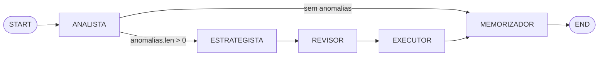
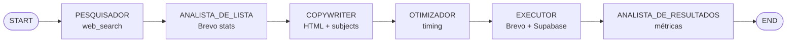
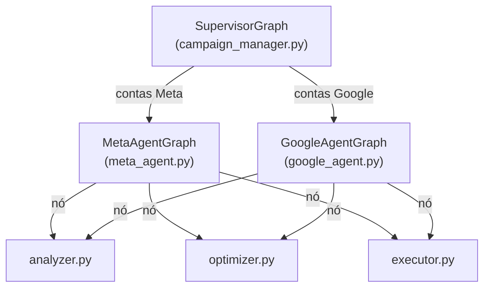

# Agente LangGraph — Documentação Técnica

O sistema contém dois grafos LangGraph independentes: o **Ads Agent Graph** (principal) e o **Email Agent Graph**. Ambos estão implementados em `agent/graph.py` e `agent/email_graph.py`.

---

## Ads Agent Graph

**Arquivo:** `agent/graph.py`  
**Instância compilada:** `agent.graph.compiled_graph`  
**Ponto de entrada:** `agent.run.run_all_accounts()`

### Estado compartilhado (`AgentState`)

```python
class AgentState(TypedDict):
    # Input: contexto da conta sendo analisada
    account: dict   # linha de ad_accounts (id, platform, account_id, token, client_id)
    client: dict    # linha de clients (name, vertical, business_dna)

    # ANALISTA
    campaigns_analyzed: list[dict]
    anomalies: list[dict]

    # ESTRATEGISTA
    decision: dict          # {campaign_uuid, campaign_id, campaign_name, platform, action_type, params, reasoning}
    memory_context: list[dict]

    # REVISOR
    risk_level: str         # "LOW" | "MEDIUM" | "HIGH"
    risk_reasoning: str

    # EXECUTOR
    execution_result: dict
```

### Fluxo do Grafo



**Roteamento condicional após ANALISTA:**
```python
def _route_after_analista(state: AgentState) -> str:
    if state.get("anomalies"):
        return "estrategista"
    return "memorizador"
```

---

### Nó 1: ANALISTA

**Função:** Busca métricas dos últimos 7 dias, calcula estatísticas e identifica anomalias de performance.

**Ferramentas disponíveis:**
- `fetch_account_campaigns(ad_account_uuid)` — campanhas do Supabase
- `fetch_daily_metrics(campaign_uuid, platform, days)` — métricas históricas do Supabase
- `fetch_meta_campaigns_live(ad_account_uuid)` — campanhas em tempo real da Meta API
- `fetch_meta_insights_live(ad_account_uuid, campaign_external_id, date_start, date_end)` — insights em tempo real da Meta API

**Estratégia de coleta (prioridade):**

Para `platform == "meta"`:
1. `fetch_meta_campaigns_live` → dados em tempo real
2. Se lista vazia → `fetch_account_campaigns` → campanhas do Supabase
3. Para cada campanha: `fetch_meta_insights_live` (retorna `UnifiedMetrics` normalizado)
4. Se `spend_usd == 0` → `fetch_daily_metrics(platform="meta")`

Para outras plataformas:
1. `fetch_account_campaigns` → campanhas do Supabase
2. `fetch_daily_metrics(platform="google")`

**Thresholds de anomalia** (aplicados apenas a campanhas com ≥3 dias de dados e `confidence_score ≥ 0.4`):

| Tipo | Condição | Severidade |
|------|----------|-----------|
| `cpa_spike` | `cpa_click_último_dia > média_7d × 1.5` | high/medium |
| `roas_negative` | `roas_click_último_dia < 1.0` | high |
| `ctr_drop` | `ctr_último_dia < média_7d × 0.70` | medium |

**Output no estado:**
```json
{
  "campaigns_analyzed": [
    {
      "campaign_uuid": "uuid-interno",
      "campaign_id": "id-externo",
      "name": "Nome da campanha",
      "platform": "meta",
      "data_source": "meta_api",
      "attribution_window": "7d_click_1d_view",
      "avg_confidence": 0.92,
      "avg_cpa_click": 12.50,
      "avg_roas_click": 2.1,
      "avg_ctr": 0.032,
      "last_spend_usd": 45.0
    }
  ],
  "anomalies": [
    {
      "campaign_uuid": "uuid-interno",
      "campaign_id": "id-externo",
      "name": "Nome",
      "platform": "meta",
      "anomaly_type": "cpa_spike",
      "severity": "high",
      "current_value": 28.5,
      "avg_value": 12.5,
      "threshold": 18.75,
      "last_spend_usd": 45.0,
      "confidence_score": 0.92
    }
  ]
}
```

---

### Nó 2: ESTRATEGISTA

**Função:** Recebe anomalias, consulta memória histórica e decide a ação mais adequada.

**Ferramenta disponível:**
- `search_agent_memory(query_text, campaign_uuid, limit)` — busca memórias relevantes por correspondência textual no campo `content`

**Ações disponíveis:**

| Ação | Condição recomendada |
|------|---------------------|
| `budget_increase` | ROAS > 1.5 e há margem de escala |
| `budget_decrease` | CPA elevado; redução para controle |
| `pause_campaign` | CPA > 3× média OU ROAS < 0.5 |
| `activate_campaign` | Campanha pausada que melhorou |
| `monitor_only` | Dados insuficientes ou tendência incerta |

**Limites aplicados:**
- `settings.agent_max_budget_change_pct` (padrão: 20%) — percentual máximo de mudança de budget
- `settings.agent_max_daily_spend_usd` (padrão: $500) — limite de gasto diário

**Output no estado:**
```json
{
  "decision": {
    "campaign_uuid": "uuid-interno",
    "campaign_id": "120200123456",
    "campaign_name": "Black Friday Conversões",
    "platform": "meta",
    "action_type": "budget_increase",
    "params": {
      "new_budget_usd": 172.5,
      "budget_change_pct": 15.0
    },
    "reasoning": "ROAS 3.8x nos últimos 3 dias. Memória histórica indica que este padrão em novembro manteve-se por 5+ dias. Budget atual de R$150/dia abaixo do limite configurado de R$500."
  },
  "memory_context": []
}
```

---

### Nó 3: REVISOR

**Função:** Avalia o risco financeiro da decisão e classifica como LOW / MEDIUM / HIGH. Sem ferramentas externas — usa apenas o LLM.

**Critérios de classificação:**

| Nível | Condições |
|-------|-----------|
| `HIGH` | `pause_campaign` com `last_spend_usd > 100` **OU** qualquer mudança de budget > 20% com spend > $200/dia |
| `MEDIUM` | `pause_campaign` com spend entre $50–$100 **OU** mudança de budget > 20% (qualquer spend) **OU** `budget_decrease` > 30% |
| `LOW` | Qualquer outra ação, incluindo `monitor_only` |

**Output no estado:**
```json
{
  "risk_level": "MEDIUM",
  "risk_reasoning": "budget_increase de 15% em campanha com spend de $150/dia. Abaixo do threshold HIGH (spend < $200 e variação < 20%), mas acima do LOW por envolver mudança de budget com spend relevante."
}
```

---

### Nó 4: EXECUTOR

**Função:** Executa a ação via API ou enfileira para aprovação humana, dependendo do `risk_level` e do `agent_autonomous_mode`.

**Ferramentas disponíveis:**
- `save_decision(campaign_uuid, action_type, reasoning, payload, executed, approved_by)` — registra em `agent_decisions`
- `run_meta_action(action_type, campaign_external_id, account_external_id, daily_budget_usd)` — executa via Meta Ads API
- `run_google_action(action_type, customer_id, campaign_external_id, account_external_id, campaign_budget_id, amount_micros)` — executa via Google Ads API
- `notify_human(campaign_name, action_type, risk_level, reasoning, decision_id)` — envia para n8n → WhatsApp

**Lógica de decisão:**

```
risk_level == LOW  E autonomous_mode == true  → executa via API + save_decision(executed=true, approved_by="autonomous")
risk_level == LOW  E autonomous_mode == false → save_decision(executed=false) + notify_human
risk_level == MEDIUM ou HIGH                  → save_decision(executed=false) + notify_human
```

**Output no estado:**
```json
{
  "execution_result": {
    "executed": false,
    "decision_id": "uuid-da-decisao",
    "notification_sent": true,
    "api_result": {}
  }
}
```

---

### Nó 5: MEMORIZADOR

**Função:** Consolida os aprendizados do ciclo em `agent_memory` para enriquecer decisões futuras.

**Ferramenta disponível:**
- `save_memory(content, memory_type, campaign_uuid)` — insere em `agent_memory`

**Tipos de memória:**

| Tipo | Uso |
|------|-----|
| `observation` | Fato isolado observado neste ciclo |
| `pattern` | Comportamento recorrente ou tendência identificada |
| `rule` | Causa-efeito confirmado ("quando X → fazer Y") |
| `context` | Informação duradoura sobre campanha ou cliente |

**Diretrizes:**
- Salva de 1 a 3 memórias por ciclo (qualidade > quantidade)
- Se sem anomalias: salva observação de "performance estável"
- Se houve ação executada: salva raciocínio + resultado como `observation` ou `pattern`
- Inclui valores numéricos, nomes e datas quando relevante

---

## Helper: `_agent_loop`

Ambos os grafos usam um helper compartilhado que implementa o ciclo LLM → tool calls → resultados:

```python
async def _agent_loop(
    tools: list,
    system_prompt: str,
    user_prompt: str,
    max_iterations: int = 6,
) -> str:
    """Ciclo LLM → tool calls → resultados → LLM até resposta textual final."""
```

O loop:
1. Envia `SystemMessage` + `HumanMessage` ao LLM
2. Verifica se há `tool_calls` na resposta
3. Se sim, executa cada ferramenta e adiciona `ToolMessage` ao histórico
4. Repete até o LLM retornar resposta textual (sem tool calls) ou esgotar `max_iterations`
5. Em caso de esgotamento, retorna o último conteúdo textual de `AIMessage`

---

## Email Agent Graph

**Arquivo:** `agent/email_graph.py`  
**Instância compilada:** `agent.email_graph.compiled_email_graph`  
**Endpoint:** `POST /run-email`

### Estado compartilhado (`EmailAgentState`)

```python
class EmailAgentState(TypedDict):
    client: dict                 # linha de clients

    # PESQUISADOR
    briefing: dict               # {market_summary, competitor_signals, trends, hooks}

    # ANALISTA_DE_LISTA
    analysis: dict               # {list_id, recommended_segment, best_weekday, best_hour, baseline_metrics}

    # COPYWRITER
    copy_variants: list[dict]    # [{subject, preheader}, ...] (3 variações)
    html_content: str            # corpo HTML único

    # OTIMIZADOR
    scheduled_at: str            # ISO 8601 UTC

    # EXECUTOR
    campaign_id: int | None      # campaign_id_brevo
    db_row_id: str | None        # uuid em email_campaigns

    # ANALISTA_DE_RESULTADOS
    report: dict
```

### Fluxo do Grafo



### Nós do Email Graph

| Nó | Ferramentas | Função |
|----|-------------|--------|
| `pesquisador` | `web_search` (Anthropic native) | Pesquisa mercado, concorrentes e tendências via web search |
| `analista_de_lista` | `fetch_lists`, `fetch_recent_campaigns`, `fetch_best_send_time` | Analisa histórico Brevo, recomenda lista e melhor horário |
| `copywriter` | — (apenas LLM) | Gera 3 subjects + 1 HTML completo mobile-friendly |
| `otimizador` | — (apenas LLM) | Calcula `scheduled_at` respeitando anti-fadiga e janela horária |
| `executor` | `create_brevo_campaign`, `save_email_campaign_row` | Cria campanha no Brevo e persiste em `email_campaigns` |
| `analista_de_resultados` | `fetch_campaign_report`, `update_email_campaign_report`, `save_email_memory` | Coleta métricas pós-envio e salva aprendizados |

**Observações do EXECUTOR:**
- Chama a API Brevo diretamente (sem LLM) para evitar alucinações em parâmetros críticos (`list_id`, `client_id`, `scheduled_at`).
- Se `scheduled_at` está presente, a campanha é **agendada** — não chama `sendNow`.

**Observações do PESQUISADOR:**
- Usa a server-tool nativa Anthropic `web_search_20250305` (até 5 buscas por ciclo).
- Foca em fontes dos últimos 90 dias.

---

## Grafos Planejados

Os arquivos `agent/graphs/meta_agent.py`, `agent/graphs/google_agent.py` e `agent/graphs/campaign_manager.py` existem no repositório mas estão **vazios** (aguardando implementação).

A arquitetura planejada é:



Atualmente, `agent/graph.py` implementa um grafo único que detecta a plataforma pelo campo `account.platform` e chama as ferramentas corretas (Meta ou Google) no mesmo fluxo.

---

## Unified Marketing Schema (Normalizer)

**Arquivo:** `agent/tools/normalizer.py`

O normalizer converte raw payloads de Meta Ads API, Google Ads API e Supabase para um schema unificado (`UnifiedMetrics`), garantindo que o ANALISTA sempre trabalhe com campos padronizados.

```python
class UnifiedMetrics(TypedDict):
    platform: str           # "meta" | "google" | "unknown"
    date: str               # "YYYY-MM-DD" ou "aggregated"
    data_source: str        # "meta_api" | "google_api" | "supabase" | "seed"
    spend_usd: float
    impressions: int
    clicks: int
    conversions_click: float   # atribuídas a clique
    conversions_view: float    # atribuídas a view-through
    revenue_usd: float
    cpa_click: float | None
    roas_click: float | None
    ctr: float
    attribution_window: str    # "7d_click_1d_view" | "30d_click_1d_view" | "unknown"
    confidence_score: float    # 0.0–1.0
```

**Tiers de confidence score:**

| Score | Fonte |
|-------|-------|
| 0.90–0.95 | Meta API com breakdown completo por janela |
| 0.75–0.85 | Meta API sem breakdown (estima 85% click / 15% view) |
| 0.60–0.65 | Linha Supabase com raw_payload real pré-agregado |
| 0.40 | Seed / legacy — sem informação de atribuição |

**Diferenças de atribuição por plataforma:**

| Plataforma | Janela padrão | `conversions_click` | `conversions_view` |
|-----------|--------------|--------------------|--------------------|
| Meta | `7d_click_1d_view` | `actions[].7d_click` (ou 85% do total) | `actions[].1d_view` (ou 15%) |
| Google | `30d_click_1d_view` | `metrics.conversions` | `metrics.view_through_conversions` |
