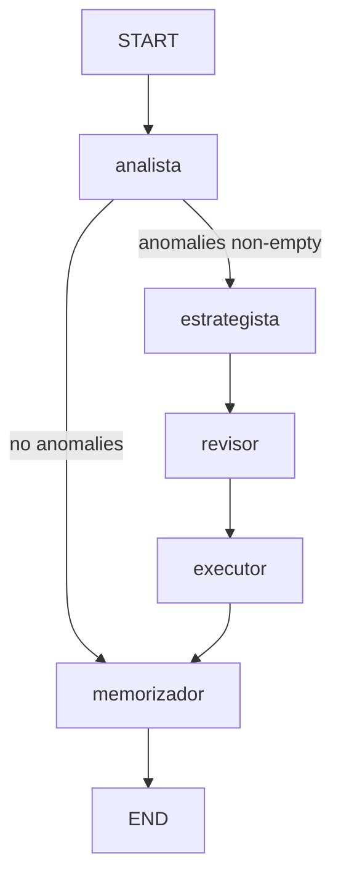

# Agente LangGraph

## Visão geral

O projeto possui **dois grafos LangGraph** implementados:

| Grafo | Arquivo | Trigger | Função |
|-------|---------|---------|--------|
| Ads Agent | `agent/graph.py` | `POST /run`, `python -m agent.run` | Otimização de campanhas Meta/Google |
| Email Agent | `agent/email_graph.py` | `POST /run-email` | Campanhas de email via Brevo |

A arquitetura documentada no README (Supervisor → Meta Agent + Google Agent) está **[PLANEJADO]** — os arquivos em `agent/graphs/` e `agent/nodes/` são stubs vazios. O grafo de ads atual é monolítico e trata ambas as plataformas via `account.platform`.

---

## Grafo de Ads — Estado (`AgentState`)

Definido em `agent/graph.py`:

```python
class AgentState(TypedDict):
    # Input
    account: dict   # linha de ad_accounts
    client: dict    # linha de clients (name, vertical, business_dna)

    # ANALISTA
    campaigns_analyzed: list[dict]
    anomalies: list[dict]

    # ESTRATEGISTA
    decision: dict
    memory_context: list[dict]  # sempre [] hoje — busca feita inline pelo LLM

    # REVISOR
    risk_level: str         # "LOW" | "MEDIUM" | "HIGH"
    risk_reasoning: str

    # EXECUTOR
    execution_result: dict
```

**Entrada inicial** (`agent/run.py`):

```python
initial_state: AgentState = {
    "account": account,
    "client": client,
    "campaigns_analyzed": [],
    "anomalies": [],
    "decision": {},
    "memory_context": [],
    "risk_level": "",
    "risk_reasoning": "",
    "execution_result": {},
}
```

---

## Grafo de Ads — Estrutura



Compilação:

```python
compiled_graph = build_graph().compile()
```

Roteamento condicional após `analista`:

```python
def _route_after_analista(state: AgentState) -> str:
    if state.get("anomalies"):
        return "estrategista"
    return "memorizador"
```

---

## Nós do grafo de Ads

### 1. `analista` (`analista_node`)

**Papel:** Coletar métricas dos últimos 7 dias e detectar anomalias.

**Ferramentas:**
- `fetch_account_campaigns` — campanhas do Supabase
- `fetch_daily_metrics` — métricas normalizadas (`UnifiedMetrics`)
- `fetch_meta_campaigns_live` — campanhas Meta em tempo real
- `fetch_meta_insights_live` — insights Meta normalizados

**Estratégia por plataforma:**
- **Meta:** prioriza API live; fallback Supabase
- **Google:** apenas Supabase (`fetch_account_campaigns` + `fetch_daily_metrics`) — ferramentas live em `agent/tools/google_ads.py` existem mas **não estão ligadas ao grafo**

**Thresholds de anomalia** (prompt `_ANALISTA_SYSTEM`):

| Tipo | Condição |
|------|----------|
| `cpa_spike` | `cpa_click` último dia > média 7d × 1.5 |
| `roas_negative` | `roas_click` último dia < 1.0 |
| `ctr_drop` | `ctr` último dia < média 7d × 0.70 |

Requisitos: ≥3 dias de dados, `confidence_score >= 0.4`.

**Saída:** `campaigns_analyzed`, `anomalies`

---

### 2. `estrategista` (`estrategista_node`)

**Papel:** Decidir ação com base nas anomalias e memória histórica.

**Ferramentas:** `search_agent_memory` (busca textual `ilike` — embeddings **[PLANEJADO]**)

**Ações possíveis:**
- `budget_increase` / `budget_decrease`
- `pause_campaign` / `activate_campaign`
- `monitor_only`

**Contexto injetado no prompt:**
- `client.business_dna`
- `settings.agent_max_budget_change_pct`
- `settings.agent_max_daily_spend_usd`

**Saída:** `decision` (JSON com `action_type`, `params`, `reasoning`)

---

### 3. `revisor` (`revisor_node`)

**Papel:** Classificar risco financeiro da decisão.

**Critérios** (`_REVISOR_SYSTEM`):

| Nível | Critério |
|-------|----------|
| **HIGH** | `pause_campaign` com `last_spend_usd > 100` OU mudança budget >20% com spend >$200/dia |
| **MEDIUM** | `pause_campaign` com spend $50–100 OU mudança budget >20% OU `budget_decrease` >30% |
| **LOW** | Demais casos, incluindo `monitor_only` |

Default em falha de parse: `"HIGH"`.

**Saída:** `risk_level`, `risk_reasoning`

---

### 4. `executor` (`executor_node`)

**Papel:** Executar ou enfileirar para aprovação humana.

**Ferramentas:**
- `save_decision` — insert em `agent_decisions`
- `run_meta_action` — pause/activate/budget Meta
- `run_google_action` — pause/activate/budget Google
- `notify_human` — POST para `N8N_WEBHOOK_URL`

**Regras de execução** (`_EXECUTOR_SYSTEM`):

| `risk_level` | `AGENT_AUTONOMOUS_MODE` | Comportamento |
|--------------|-------------------------|---------------|
| LOW | `true` | Executa API + `save_decision(executed=true, approved_by="autonomous")` |
| LOW | `false` | `save_decision(executed=false)` + `notify_human` |
| MEDIUM / HIGH | qualquer | `save_decision(executed=false)` + `notify_human` |

**Saída:** `execution_result`

---

### 5. `memorizador` (`memorizador_node`)

**Papel:** Consolidar aprendizados em `agent_memory`.

**Ferramentas:** `save_memory` (`memory_type`: `observation`, `pattern`, `rule`, `context`)

Embeddings: gravados como `null` até integração do serviço de embeddings **[PLANEJADO]**.

---

## Loop LLM + ferramentas

Todos os nós usam `_agent_loop()` — até 6 iterações de tool-calling com `ChatAnthropic`:

```python
_llm = ChatAnthropic(
    model=settings.anthropic_model,
    api_key=settings.anthropic_api_key,
    max_tokens=4096,
)
```

---

## Entry point — `agent/run.py`

```python
async def run_all_accounts() -> None:
    result = (
        supabase.table("ad_accounts")
        .select("*, clients(*)")
        .eq("active", True)
        .execute()
    )
    for row in accounts_to_run:
        client = row.pop("clients", {}) or {}
        await run_account(account=row, client=client)
```

Contas processadas **sequencialmente** (paralelização **[PLANEJADO]**).

---

## Grafo de Email — `EmailAgentState`

Arquivo: `agent/email_graph.py`

```python
class EmailAgentState(TypedDict):
    client: dict
    briefing: dict
    analysis: dict
    copy_variants: list[dict]
    html_content: str
    scheduled_at: str
    campaign_id: int | None      # campaign_id_brevo
    db_row_id: str | None
    report: dict
```

**Fluxo sequencial (sem branches):**

```
pesquisador → analista_de_lista → copywriter → otimizador → executor → analista_de_resultados
```

| Nó | LLM | Função |
|----|-----|--------|
| `pesquisador` | Sim (+ web_search) | Briefing de mercado |
| `analista_de_lista` | Sim | Análise da lista Brevo |
| `copywriter` | Sim | 3 variantes de subject + HTML |
| `otimizador` | Sim | `scheduled_at` com regras anti-fatiga |
| `executor` | **Não** | Chamadas determinísticas Brevo + Supabase |
| `analista_de_resultados` | Sim | Métricas pós-envio |

---

## Arquitetura alvo — Supervisor [PLANEJADO]

```
SupervisorGraph
├── MetaAgent Graph → campanha Facebook/Instagram
│   ├── node: analyzer
│   ├── node: optimizer
│   └── node: executor
└── GoogleAgent Graph → campanha Google Ads
    ├── node: analyzer
    ├── node: optimizer
    └── node: executor

Nós compartilhados:
- reporter → summaries e alertas
- memory → leitura/gravação Supabase
```

Arquivos stub: `agent/graphs/campaign_manager.py`, `meta_agent.py`, `google_agent.py`, `agent/nodes/*.py`, `agent/memory/store.py`, `agent/prompts/templates.py`.

---

## Guardrails por cliente

Hoje os limites numéricos são **globais** via variáveis de ambiente (`AGENT_MAX_DAILY_SPEND_USD`, `AGENT_MAX_BUDGET_CHANGE_PCT`, `AGENT_AUTONOMOUS_MODE`).

O campo `clients.business_dna` influencia o comportamento via prompt:

| Campo em `business_dna` | Uso |
|------------------------|-----|
| `objetivo_principal` | Texto com CPA alvo (ex.: `"CPA < $25"`) — usado pelo kill switch |
| `restricoes` | Array de regras de negócio injetadas no prompt do estrategista |
| `tom_de_voz`, `produtos_destaque`, etc. | Contexto para decisões e email |

**`autonomous_mode` por cliente** — **[PLANEJADO]**. Hoje apenas `AGENT_AUTONOMOUS_MODE` global em `agent/config.py`.

Detalhes: [guardrails.md](./guardrails.md).

---

## Tabela `agent_executions`

**Não existe** no schema. Execução é rastreada via:
- `agent_decisions.executed`, `approved_at`, `payload.api_result`
- `AgentState.execution_result` (em memória durante o ciclo)

---

## Links

- [api.md](./api.md) — endpoints que disparam os grafos
- [supabase.md](./supabase.md) — tabelas persistidas
- [integrations.md](./integrations.md) — ferramentas Meta/Google/Brevo
- [architecture.md](./architecture.md) — diagramas de fluxo
