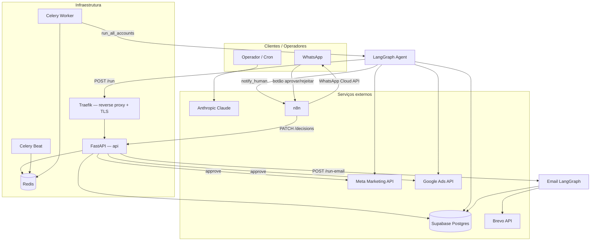
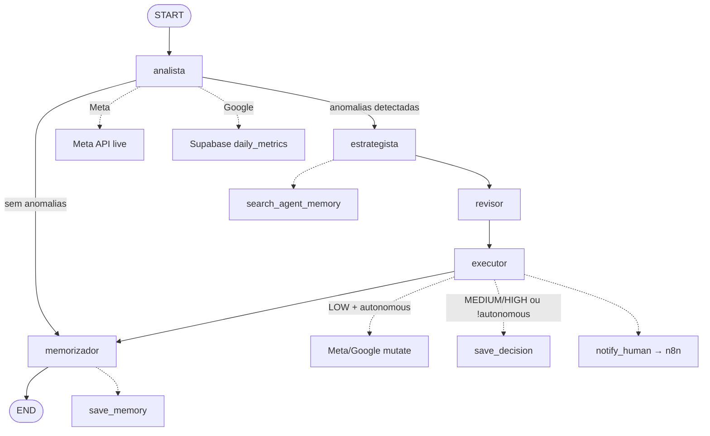
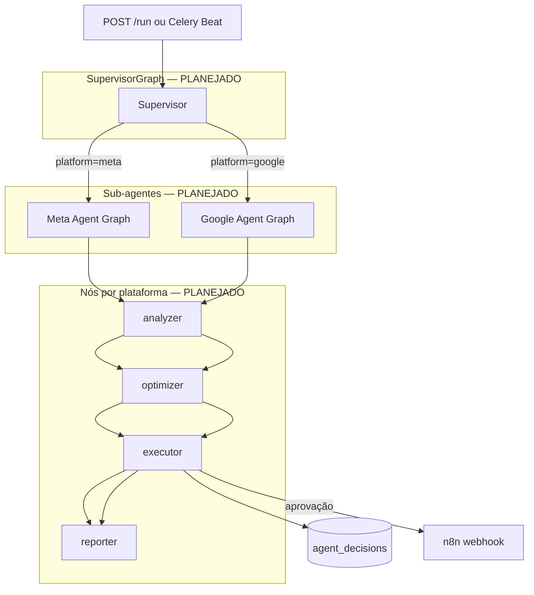
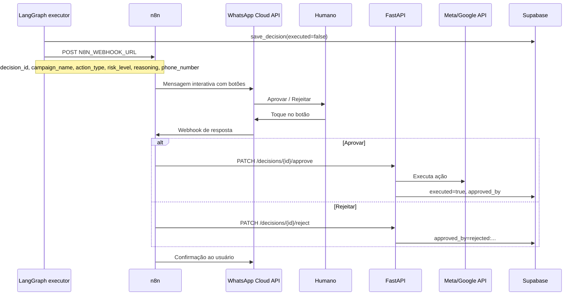
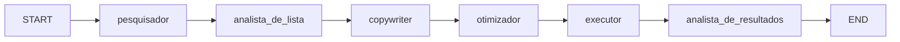
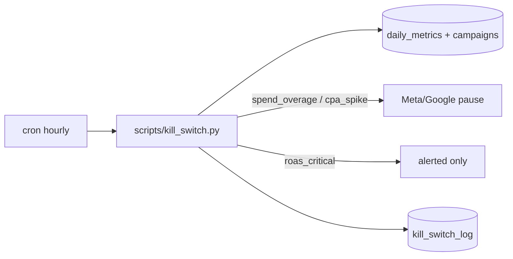

# Arquitetura

## Visão geral

O Veltrus Ads Agent é um sistema de agentes LLM que opera sobre dados de campanhas armazenados no Supabase e APIs externas (Meta, Google, Brevo). A API FastAPI expõe triggers e o fluxo de aprovação humana; o agente roda como processo Python com LangGraph.

## Stack de produção

> **Nota:** Celery, Redis, Traefik e Docker Swarm estão documentados em [deploy.md](./deploy.md). No branch `main`, o deploy atual usa Railway (`railway.json`) ou `uvicorn` direto. A stack Swarm + Traefik é **[PLANEJADO]** — existe referência parcial na branch `cursor/docker-deploy-vps-96fb` com Docker Compose + Caddy.

## Fluxo do agente de ads (implementado)

Hoje o grafo é **monolítico** em `agent/graph.py`. A arquitetura multi-agente com Supervisor está **[PLANEJADO]** (arquivos em `agent/graphs/` são stubs vazios).

## Arquitetura alvo — Supervisor + sub-agentes [PLANEJADO]

Arquivos stub (vazios): `agent/graphs/campaign_manager.py`, `agent/graphs/meta_agent.py`, `agent/graphs/google_agent.py`, `agent/nodes/analyzer.py`, `optimizer.py`, `executor.py`, `reporter.py`.

## Fluxo de aprovação humana (n8n → WhatsApp)

O código atual usa **WhatsApp Business Cloud API** via n8n. **Evolution API** não está integrada no repositório — listada como opção futura abaixo.

### Evolution API [PLANEJADO]

Substituir ou complementar o WhatsApp Cloud API no workflow n8n com [Evolution API](https://github.com/EvolutionAPI/evolution-api) para self-hosting. O contrato do agente permanece o mesmo: `notify_human` envia POST ao webhook n8n; o n8n roteia para Evolution ou Cloud API.

## Agente de email (implementado)

Grafo separado em `agent/email_graph.py`, sem relação com o fluxo de ads:

Disparo: `POST /run-email` com `client_id` e `list_id` (Brevo).

## Kill switch (independente do LangGraph)

## Camadas de dados

| Camada | Responsabilidade |
|--------|------------------|
| `clients` | Identidade do cliente, `business_dna` (objetivos, restrições) |
| `ad_accounts` | Tokens OAuth por plataforma |
| `campaigns` + `daily_metrics` | Estado e métricas normalizadas |
| `agent_decisions` | Decisões pendentes e histórico de execução |
| `agent_memory` | Memória textual (embeddings [PLANEJADO]) |
| `kill_switch_log` | Auditoria do script de segurança |

Detalhes: [supabase.md](./supabase.md).

## Componentes por status

| Componente | Status | Localização |
|------------|--------|-------------|
| Grafo ads monolítico | Implementado | `agent/graph.py` |
| Grafo email | Implementado | `agent/email_graph.py` |
| Supervisor / Meta / Google graphs | [PLANEJADO] | `agent/graphs/*.py` (vazios) |
| API REST (6 endpoints) | Implementado | `api/` |
| Celery + Redis | [PLANEJADO] no main; parcial em branch docker | `celery_app.py` na branch docker |
| Dashboard Next.js | Scaffold | `dashboard/` |
| WebSocket | [PLANEJADO] | mencionado no README, sem código |
| Evolution API | [PLANEJADO] | não referenciada no código |

## Links

- [agent.md](./agent.md) — detalhes dos nós LangGraph
- [api.md](./api.md) — endpoints
- [integrations.md](./integrations.md) — APIs externas
- [guardrails.md](./guardrails.md) — segurança financeira
- [deploy.md](./deploy.md) — Docker Swarm + Traefik
