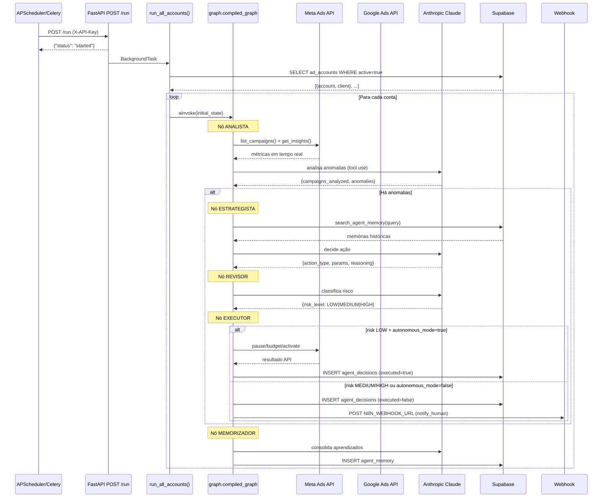
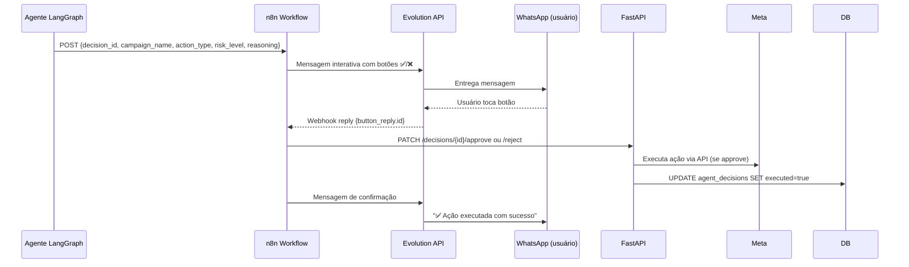

# Arquitetura — Veltrus Ads Agent

## Visão Geral

```mermaid
graph TD
    subgraph Externo["Externas (usuário/operador)"]
        WA["WhatsApp\n(Evolution API)"]
        Dashboard["Dashboard\n(Next.js 14)"]
    end

    subgraph Infra["Infraestrutura (Docker Swarm)"]
        Traefik["Traefik\n(proxy reverso / TLS)"]
        API["FastAPI\n:8000"]
        N8N["n8n\n(automação)"]
        Redis["Redis\n(fila Celery)"]
    end

    subgraph Agent["Agente (Python / LangGraph)"]
        Runner["run_all_accounts()"]
        MainGraph["graph.py\n(Ads Agent Graph)"]
        EmailGraph["email_graph.py\n(Email Agent Graph)"]
        KillSwitch["kill_switch.py\n(cron independente)"]
    end

    subgraph AdsGraph["Ads Agent Graph (LangGraph)"]
        Analista["ANALISTA\n(coleta + anomalias)"]
        Estrategista["ESTRATEGISTA\n(decide ação)"]
        Revisor["REVISOR\n(classifica risco)"]
        Executor["EXECUTOR\n(executa ou enfileira)"]
        Memorizador["MEMORIZADOR\n(salva aprendizados)"]
    end

    subgraph EmailAgentGraph["Email Agent Graph (LangGraph)"]
        Pesquisador["PESQUISADOR\n(web search)"]
        AnalistaLista["ANALISTA_DE_LISTA\n(Brevo stats)"]
        Copywriter["COPYWRITER\n(HTML + subjects)"]
        Otimizador["OTIMIZADOR\n(timing)"]
        ExecEmail["EXECUTOR\n(cria campanha Brevo)"]
        Resultados["ANALISTA_DE_RESULTADOS\n(métricas pós-envio)"]
    end

    subgraph Externas["APIs Externas"]
        MetaAPI["Meta Marketing API\nv21.0"]
        GoogleAPI["Google Ads API\n(GAQL + mutate)"]
        AnthropicAPI["Anthropic API\n(claude-sonnet-4-6)"]
        BrevoAPI["Brevo API v3\n(email marketing)"]
    end

    subgraph DB["Supabase (Postgres + pgvector)"]
        Clients["clients"]
        AdAccounts["ad_accounts"]
        Campaigns["campaigns"]
        DailyMetrics["daily_metrics"]
        AgentDecisions["agent_decisions"]
        AgentMemory["agent_memory\n(pgvector)"]
        EmailCampaigns["email_campaigns"]
        KillSwitchLog["kill_switch_log"]
    end

    %% Fluxo externo → API
    Dashboard -->|HTTP| Traefik
    Traefik -->|proxy| API
    WA -->|webhook reply| N8N
    N8N -->|PATCH /decisions/{id}| API

    %% API → Agente
    API -->|POST /run\nBackgroundTask| Runner
    API -->|POST /run-email\nthread| EmailGraph
    API -->|GET /decisions\nPATCH approve/reject| AgentDecisions

    %% Runner → Grafos
    Runner --> MainGraph
    MainGraph --> AdsGraph

    %% Ads Agent Graph (fluxo interno)
    Analista -->|tem anomalias| Estrategista
    Analista -->|sem anomalias| Memorizador
    Estrategista --> Revisor
    Revisor --> Executor
    Executor --> Memorizador

    %% Email Agent Graph (fluxo sequencial)
    Pesquisador --> AnalistaLista
    AnalistaLista --> Copywriter
    Copywriter --> Otimizador
    Otimizador --> ExecEmail
    ExecEmail --> Resultados

    %% Kill Switch (independente)
    KillSwitch -->|cron 1h| MetaAPI
    KillSwitch -->|cron 1h| GoogleAPI
    KillSwitch --> KillSwitchLog

    %% Executor → APIs externas + notificação
    Executor -->|run_meta_action| MetaAPI
    Executor -->|run_google_action| GoogleAPI
    Executor -->|notify_human → POST| N8N
    N8N -->|formata mensagem interativa| WA

    %% LLM
    Analista -->|tool use| AnthropicAPI
    Estrategista -->|tool use| AnthropicAPI
    Revisor -->|tool use| AnthropicAPI
    Executor -->|tool use| AnthropicAPI
    Memorizador -->|tool use| AnthropicAPI
    Pesquisador -->|web_search tool| AnthropicAPI
    Copywriter -->|tool use| AnthropicAPI

    %% Dados
    Analista -->|fetch campaigns/metrics| DB
    Analista -->|fetch live| MetaAPI
    Estrategista -->|search_agent_memory| AgentMemory
    Executor -->|save_decision| AgentDecisions
    Memorizador -->|save_memory| AgentMemory
    ExecEmail -->|upsert| EmailCampaigns
    ExecEmail -->|create campaign| BrevoAPI
```

---

## Fluxo de Dados Detalhado

### 1. Ciclo de Ads (a cada 30 min)



### 2. Fluxo de Aprovação Humana (WhatsApp)



---

## Stack Detalhada

| Componente | Tecnologia | Versão | Função |
|-----------|-----------|--------|--------|
| Linguagem | Python | 3.12 | Backend / Agente |
| Orquestração de agentes | LangGraph | ≥0.2.0 | Grafos de estado, nós, roteamento condicional |
| LLM | Anthropic Claude | claude-sonnet-4-6 | Raciocínio, tool use, análise |
| LLM Client | langchain-anthropic | ≥0.3.0 | Integração LangChain → Anthropic |
| API REST | FastAPI | ≥0.115.0 | Endpoints HTTP, CORS, auth por header |
| Servidor ASGI | Uvicorn | ≥0.32.0 | Execução assíncrona |
| Validação | Pydantic v2 | ≥2.10.0 | Schemas request/response |
| Config | pydantic-settings | ≥2.7.0 | Leitura de .env tipada |
| Banco | Supabase (Postgres) | supabase-py ≥2.9.0 | Dados relacionais + REST |
| Vetores | pgvector (Supabase) | — | Memória semântica (embeddings) |
| Fila | Celery | ≥5.4.0 | Tarefas assíncronas |
| Broker | Redis | ≥5.2.0 | Broker Celery |
| Meta Ads | facebook-business | ≥21.0.0 | SDK oficial Meta Marketing API v21.0 |
| Google Ads | google-ads | ≥25.0.0 | SDK oficial Google Ads API (GAQL + mutate) |
| Email | Brevo (HTTP) | API v3 | Campanhas de email marketing |
| Logging | structlog | ≥24.4.0 | Logs estruturados em JSON |
| Frontend | Next.js 14 | App Router | Dashboard |
| UI | shadcn/ui + Tailwind | — | Componentes |
| Proxy | Traefik | v2/v3 | Ingress, TLS automático (Let's Encrypt) |
| Orquestração | Docker Swarm | — | Deploy em cluster |
| Painel | Portainer | — | UI de gerenciamento Docker |
| Automação | n8n | — | Workflow de aprovação via WhatsApp |
| WhatsApp | Evolution API | — | Mensagens WhatsApp Business |

---

## Componentes Implementados vs Planejados

| Componente | Status | Arquivo |
|-----------|--------|---------|
| Ads Agent Graph (5 nós) | ✅ Implementado | `agent/graph.py` |
| Email Agent Graph (6 nós) | ✅ Implementado | `agent/email_graph.py` |
| Meta Ads Tool | ✅ Implementado | `agent/tools/meta_ads.py` |
| Google Ads Tool | ✅ Implementado | `agent/tools/google_ads.py` |
| Brevo Email Tool | ✅ Implementado | `agent/tools/email_brevo.py` |
| Unified Marketing Schema | ✅ Implementado | `agent/tools/normalizer.py` |
| Supabase Client | ✅ Implementado | `agent/tools/supabase_client.py` |
| FastAPI (core endpoints) | ✅ Implementado | `api/main.py` |
| POST /run | ✅ Implementado | `api/routers/run.py` |
| GET/PATCH /decisions | ✅ Implementado | `api/routers/decisions.py` |
| POST /run-email | ✅ Implementado | `api/routers/run_email.py` |
| Kill Switch | ✅ Implementado | `scripts/kill_switch.py` |
| Migrations SQL (001–004) | ✅ Implementadas | `supabase/migrations/` |
| Supervisor Graph (multi-conta) | [PLANEJADO] | `agent/graphs/campaign_manager.py` |
| Meta Agent Graph dedicado | [PLANEJADO] | `agent/graphs/meta_agent.py` |
| Google Agent Graph dedicado | [PLANEJADO] | `agent/graphs/google_agent.py` |
| Nós modulares | [PLANEJADO] | `agent/nodes/` |
| Routers campaigns/analytics | [PLANEJADO] | `api/routers/campaigns.py` etc. |
| Embeddings semânticos | [PLANEJADO] | pgvector está preparado; busca atual é textual |
