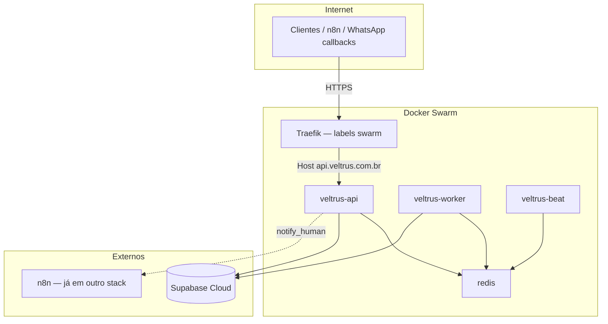

# Deploy em Produção

## Estado atual do repositório

| Método | Status | Arquivos |
|--------|--------|----------|
| Railway (PaaS) | Implementado | `railway.json`, `.env.railway.example` |
| Procfile (Heroku-style) | Implementado | `Procfile` |
| Docker Compose + Caddy | Branch `cursor/docker-deploy-vps-96fb` | `docker-compose.yml`, `Dockerfile`, `Caddyfile` |
| **Docker Swarm + Traefik** | **[PLANEJADO]** no `main` | Este documento descreve a stack alvo |

O `scripts/deploy.sh` no branch `main` está **vazio**. Na branch docker existe implementação com `docker compose up`.

---

## Stack alvo — Docker Swarm + Traefik + Portainer



> **Nota:** n8n roda em stack separada (não incluída no compose da branch docker). O agente apenas faz POST para `N8N_WEBHOOK_URL`.

---

## Ordem de inicialização dos serviços

1. **Redis** — broker Celery; deve estar healthy antes de api/worker/beat
2. **API** — FastAPI; depende de Redis healthy
3. **Worker** — consome fila Celery; depende de Redis
4. **Beat** — agendador; depende de Redis
5. **Traefik** — reverse proxy; roteia para API quando o serviço estiver up

Supabase é **externo** (SaaS) — aplicar migrations antes do primeiro deploy:

```bash
# Via Supabase CLI ou dashboard SQL
supabase db push
# ou executar manualmente supabase/migrations/*.sql
```

---

## Stack Swarm de referência [PLANEJADO]

Baseado na branch `cursor/docker-deploy-vps-96fb` (adaptado de Caddy → Traefik):

```yaml
# docker-stack.yml — PLANEJADO para Swarm
version: "3.9"

networks:
  veltrus:
    driver: overlay
    attachable: true
  traefik-public:
    external: true

volumes:
  redis_data:

services:
  redis:
    image: redis:7-alpine
    networks: [veltrus]
    volumes: [redis_data:/data]
    command: redis-server --appendonly yes --maxmemory 256mb --maxmemory-policy allkeys-lru
    deploy:
      replicas: 1
      placement:
        constraints: [node.role == manager]

  api:
    image: veltrus-ads-agent:latest
    networks: [veltrus, traefik-public]
    env_file: .env
    environment:
      REDIS_URL: redis://redis:6379/0
    command: uvicorn api.main:app --host 0.0.0.0 --port 8000 --workers 2
    deploy:
      replicas: 2
      labels:
        - traefik.enable=true
        - traefik.http.routers.veltrus-api.rule=Host(`api.veltrus.com.br`)
        - traefik.http.routers.veltrus-api.entrypoints=websecure
        - traefik.http.routers.veltrus-api.tls.certresolver=letsencrypt
        - traefik.http.services.veltrus-api.loadbalancer.server.port=8000
    depends_on: [redis]

  worker:
    image: veltrus-ads-agent:latest
    networks: [veltrus]
    env_file: .env
    environment:
      REDIS_URL: redis://redis:6379/0
    command: celery -A celery_app worker --loglevel=info --concurrency=2 -Q celery
    deploy:
      replicas: 1

  beat:
    image: veltrus-ads-agent:latest
    networks: [veltrus]
    env_file: .env
    environment:
      REDIS_URL: redis://redis:6379/0
    command: celery -A celery_app beat --loglevel=info
    deploy:
      replicas: 1
```

### Dockerfile (branch docker)

Multi-stage Python 3.12-slim com healthcheck em `/health`:

```dockerfile
FROM python:3.12-slim AS final
WORKDIR /app
# ... pip install requirements.txt
EXPOSE 8000
HEALTHCHECK CMD curl -f http://localhost:8000/health
```

### Celery (branch docker)

```python
# celery_app.py
app.conf.beat_schedule = {
    "run-agent-cycle": {
        "task": "tasks.run_agent_cycle",
        "schedule": timedelta(minutes=_interval_minutes),
    },
}
```

`tasks.run_agent_cycle` chama `run_all_accounts()` — equivalente a `POST /run`.

---

## Deploy via Portainer

### Pré-requisitos

1. Cluster Docker Swarm inicializado (`docker swarm init`)
2. Traefik rodando como stack com rede `traefik-public`
3. Portainer conectado ao Swarm
4. Imagem `veltrus-ads-agent:latest` buildada e disponível nos nodes

### Passos

1. **Build da imagem** (em CI ou manualmente no manager):

```bash
docker build -t veltrus-ads-agent:latest .
docker save veltrus-ads-agent:latest | ssh node docker load  # se multi-node
```

2. **Criar secret/env no Portainer:**
   - Stacks → Add stack → Web editor
   - Colar `docker-stack.yml`
   - Em **Environment variables**, carregar `.env` de produção (ver tabela abaixo)

3. **Deploy the stack** — Portainer envia para o Swarm

4. **Verificar health:**

```bash
curl https://api.veltrus.com.br/health
# {"status":"ok","version":"0.1.0"}
```

5. **Configurar cron do kill switch** (fora do Swarm ou como serviço one-shot):

```cron
0 * * * * docker exec $(docker ps -qf name=veltrus_worker) python scripts/kill_switch.py
```

Alternativa: serviço Swarm separado com `cron` ou job agendado no Portainer.

---

## Variáveis de ambiente obrigatórias

| Variável | Obrigatória | Descrição |
|----------|-------------|-----------|
| `ANTHROPIC_API_KEY` | **Sim** | LLM |
| `SUPABASE_URL` | **Sim** | URL do projeto |
| `SUPABASE_SERVICE_ROLE_KEY` | **Sim** | Acesso server-side (bypass RLS) |
| `API_SECRET_KEY` | **Sim** | Auth `X-API-Key` |
| `GOOGLE_ADS_DEVELOPER_TOKEN` | Sim* | *Se houver contas Google |
| `GOOGLE_ADS_CLIENT_ID` | Sim* | OAuth Google |
| `GOOGLE_ADS_CLIENT_SECRET` | Sim* | OAuth Google |
| `META_API_VERSION` | Não | Default `v21.0` |
| `REDIS_URL` | Sim** | **Obrigatória com Celery; default `redis://redis:6379/0` no stack |
| `AGENT_AUTONOMOUS_MODE` | Não | Default `false` |
| `AGENT_MAX_DAILY_SPEND_USD` | Não | Default `500` |
| `AGENT_MAX_BUDGET_CHANGE_PCT` | Não | Default `20` |
| `AGENT_CYCLE_INTERVAL_MINUTES` | Não | Default `30` (Celery beat) |
| `N8N_WEBHOOK_URL` | Não | Webhook n8n para WhatsApp |
| `NOTIFY_PHONE_NUMBER` | Não | E.164 para notificações |
| `BREVO_API_KEY` | Não* | *Obrigatória para `/run-email` |
| `API_ALLOWED_ORIGINS` | Não | CORS, comma-separated |
| `ENVIRONMENT` | Não | `production` em prod |
| `DEBUG` | Não | `false` em prod |

Tokens Meta/Google por conta ficam em `ad_accounts.token` no Supabase — não precisam estar no `.env` se todas as contas tiverem token no banco.

> `BREVO_API_KEY` está em `agent/config.py` mas **ausente** em `.env.example` — adicionar manualmente.

---

## Deploy alternativo — Railway (implementado)

```json
// railway.json
{
  "build": { "builder": "NIXPACKS" },
  "deploy": {
    "startCommand": "uvicorn api.main:app --host 0.0.0.0 --port $PORT --workers 2",
    "healthcheckPath": "/health"
  }
}
```

Sem Redis/Celery no Railway — ciclos do agente via `POST /run` externo (cron) ou manual.

---

## Deploy alternativo — Docker Compose (branch docker)

Branch `origin/cursor/docker-deploy-vps-96fb`:

```bash
cp .env.example .env
# preencher variáveis
docker compose up -d --build
curl http://localhost:8000/health
```

Serviços: `redis`, `api`, `worker`, `beat`, `caddy` (não Traefik).

Scripts na branch:
- `scripts/setup.sh` — verifica Docker + `.env`
- `scripts/deploy.sh` — sobe containers + health check
- `scripts/remote_deploy.sh` — deploy remoto via SSH + rsync

---

## Checklist pós-deploy

- [ ] `GET /health` retorna `200`
- [ ] Migrations Supabase aplicadas (`001`–`004`)
- [ ] Pelo menos uma conta em `ad_accounts` com `token` válido
- [ ] `POST /run` com `X-API-Key` inicia ciclo sem erro nos logs
- [ ] `N8N_WEBHOOK_URL` configurado (se aprovação WhatsApp ativa)
- [ ] Kill switch no cron (`scripts/kill_switch.py`)
- [ ] `AGENT_AUTONOMOUS_MODE=false` até validação em staging

---

## Links

- [architecture.md](./architecture.md) — diagrama da stack
- [api.md](./api.md) — endpoints e health check
- [integrations.md](./integrations.md) — credenciais externas
- [guardrails.md](./guardrails.md) — variáveis de segurança
