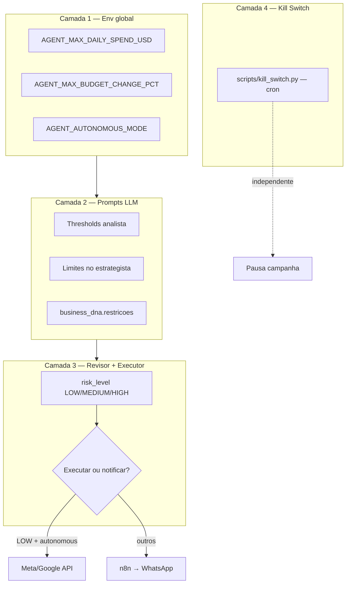

# Guardrails — Regras de Segurança

O Veltrus Ads Agent possui **quatro camadas** de proteção: limites globais via env, prompts do LLM, classificação de risco no revisor, e kill switch independente.

---

## Visão geral das camadas



---

## 1. Variáveis de ambiente globais

Definidas em `agent/config.py` e `.env.example`:

| Variável | Default | Função |
|----------|---------|--------|
| `AGENT_MAX_DAILY_SPEND_USD` | `500.0` | Teto de gasto diário — injetado no prompt do estrategista e revisor |
| `AGENT_MAX_BUDGET_CHANGE_PCT` | `20.0` | Percentual máximo de ajuste de budget por ciclo |
| `AGENT_AUTONOMOUS_MODE` | `false` | Se `true`, executa ações LOW sem aprovação humana |

```python
# agent/config.py
agent_max_daily_spend_usd: float = 500.0
agent_max_budget_change_pct: float = 20.0
agent_autonomous_mode: bool = False
```

### Budget diário como teto absoluto

**Status:** injetado nos **prompts** do estrategista e revisor — **não há validação programática** antes de chamar a API externa.

O valor é passado ao LLM:

```python
# agent/graph.py — estrategista_node
Limites configurados:
- Mudança máxima de budget por ciclo: {settings.agent_max_budget_change_pct}%
- Limite de gasto diário: ${settings.agent_max_daily_spend_usd}
```

Enforcement hard-coded **[PLANEJADO]**.

### `max_budget_change_pct`

Usado no prompt do estrategista e como referência no revisor (critério de risco MEDIUM/HIGH para mudanças >20%).

Não há checagem de código que bloqueie um `budget_increase` de 25% antes da execução.

### `min_roas`

Não existe variável `min_roas` ou `MIN_ROAS` no código.

Equivalentes implementados:

| Local | Threshold | Comportamento |
|-------|-----------|---------------|
| Analista (prompt) | `roas_click < 1.0` | Anomalia `roas_negative` |
| Kill switch | `ROAS_MIN = 0.5` | Alerta (`roas_critical`), **sem pausa** |
| Estrategista (prompt) | `ROAS < 0.5` | Sugere `pause_campaign` |

### `max_cpa_brl`

Não existe campo `max_cpa_brl` explícito.

O CPA máximo é **extraído do texto** em `clients.business_dna.objetivo_principal`:

```python
# scripts/kill_switch.py
def _extract_cpa_max(business_dna: dict) -> float | None:
    objetivo = business_dna.get("objetivo_principal", "") or ""
    match = re.search(r"cpa\s*[<abaixode\s]*\$?\s*(\d+(?:\.\d+)?)", objetivo, re.IGNORECASE)
```

Exemplo: `"maximizar ROAS mantendo CPA < $25"` → `cpa_max = 25.0`

> O regex aceita `$` (USD). Valores em BRL no `business_dna` não são parseados automaticamente.

---

## 2. Thresholds do analista (prompt)

Em `_ANALISTA_SYSTEM` (`agent/graph.py`):

| Anomalia | Condição |
|----------|----------|
| `cpa_spike` | `cpa_click` último dia > média 7d × **1.5** |
| `roas_negative` | `roas_click` último dia < **1.0** |
| `ctr_drop` | `ctr` último dia < média 7d × **0.70** |

Requisitos: ≥3 dias de dados, `confidence_score >= 0.4`. Anomalias com `confidence_score < 0.6` devem ser ponderadas com cautela (instrução no prompt).

---

## 3. Revisor — classificação de risco

Critérios em `_REVISOR_SYSTEM`:

| Nível | Critério |
|-------|----------|
| **HIGH** | `pause_campaign` com `last_spend_usd > 100` OU mudança budget >20% com spend >$200/dia |
| **MEDIUM** | `pause_campaign` spend $50–100 OU mudança budget >20% OU `budget_decrease` >30% |
| **LOW** | Demais casos |

Default em falha de parse JSON: **`HIGH`** (fail-safe).

---

## 4. Executor — `autonomous_mode`

Regras em `_EXECUTOR_SYSTEM`:

| `risk_level` | `AGENT_AUTONOMOUS_MODE` | Ação |
|--------------|-------------------------|------|
| LOW | `true` | Executa API + `approved_by="autonomous"` |
| LOW | `false` | `save_decision(executed=false)` + `notify_human` |
| MEDIUM / HIGH | qualquer | `save_decision(executed=false)` + `notify_human` |

### `autonomous_mode` por cliente [PLANEJADO]

Hoje `AGENT_AUTONOMOUS_MODE` é **global** — não há campo `autonomous_mode` em `clients` ou `business_dna` lido pelo executor.

Arquitetura esperada:

```json
// business_dna — PLANEJADO
{
  "autonomous_mode": false,
  "max_daily_spend_usd": 300,
  "max_budget_change_pct": 15,
  "min_roas": 1.2,
  "max_cpa_brl": 80
}
```

---

## 5. Guardrails por cliente (`business_dna`)

Campos usados **hoje**:

| Campo | Onde é usado |
|-------|--------------|
| `objetivo_principal` | Prompt estrategista; kill switch (`cpa_max`) |
| `restricoes` | Prompt estrategista (array de regras de negócio) |
| `tom_de_voz`, `produtos_destaque`, etc. | Contexto LLM (ads + email) |
| `run_context`, `preferred_list_id` | Injetados em `/run-email` |

Exemplo de restrições (`scripts/seed_test_data.py`):

```json
"restricoes": [
  "não pausar campanhas sem aprovação humana em feriados",
  "budget mínimo diário: $50"
]
```

Restrições são **orientação para o LLM** — não bloqueiam execução em código.

---

## 6. Kill Switch

Script **independente** do LangGraph: `scripts/kill_switch.py`

Roda via cron (recomendado: a cada hora). Não depende de `AGENT_AUTONOMOUS_MODE`.

### Regras

| `trigger_type` | Condição | Constante | Ação |
|----------------|----------|-----------|------|
| `spend_overage` | `spend_hoje > daily_budget × 1.1` | `SPEND_MULT = 1.1` | **Pausa** campanha |
| `cpa_spike` | `cpa_hoje > cpa_max × 2.0` | `CPA_MULT = 2.0` | **Pausa** campanha |
| `roas_critical` | `roas_hoje < 0.5` | `ROAS_MIN = 0.5` | **Alerta** apenas (sem pausa) |

`cpa_max` vem de `business_dna.objetivo_principal` (ver seção `max_cpa_brl`).

### Auditoria

Todas as ações registradas em `kill_switch_log`:

| `action_taken` | Significado |
|----------------|-------------|
| `paused` | Campanha pausada via API |
| `alerted` | Apenas log (roas_critical) |
| `pause_failed` | Tentativa de pausa falhou |
| `dry_run` | Modo simulação (`--dry-run`) |

### Execução

```bash
# Real
PYTHONPATH=. python scripts/kill_switch.py

# Simulação
PYTHONPATH=. python scripts/kill_switch.py --dry-run
```

---

## 7. Guardrails do agente de email

Em `agent/email_graph.py` (nó `otimizador`):

- Sem envio entre **22:00–06:00**
- Lead time mínimo de **2 horas**
- Anti-fatiga: gap de **3 dias** entre envios
- `needs_human_review` se lista < **100** subscribers

O nó `executor` é **determinístico** (sem LLM) para evitar `list_id` ou `scheduled_at` alucinados.

---

## 8. Autenticação da API

Endpoints protegidos exigem `X-API-Key` igual a `API_SECRET_KEY`. Impede aprovação/rejeição não autorizada via n8n.

---

## Resumo — o que é enforced em código vs prompt

| Regra | Código | Prompt LLM |
|-------|--------|------------|
| Pausa por spend/CPA (kill switch) | ✅ | — |
| Pausa por ROAS < 0.5 | ❌ (só alerta) | ✅ sugere pause |
| Max budget change % | ❌ | ✅ |
| Max daily spend USD | ❌ | ✅ |
| Autonomous mode | ✅ (executor) | ✅ |
| Risk gate MEDIUM/HIGH | ✅ (executor) | ✅ (revisor) |
| business_dna.restricoes | ❌ | ✅ |
| API key nos endpoints | ✅ | — |

---

## Recomendações operacionais

1. Manter `AGENT_AUTONOMOUS_MODE=false` até validação completa em staging.
2. Configurar cron do kill switch em produção independentemente do modo autônomo.
3. Preencher `business_dna.objetivo_principal` com CPA explícito (ex.: `CPA < $25`) para o kill switch funcionar.
4. Configurar `N8N_WEBHOOK_URL` para que decisões MEDIUM/HIGH não fiquem apenas em log.

---

## Links

- [agent.md](./agent.md) — fluxo revisor/executor
- [supabase.md](./supabase.md) — `kill_switch_log`, `business_dna`
- [integrations.md](./integrations.md) — APIs executadas após aprovação
- [deploy.md](./deploy.md) — variáveis de ambiente
