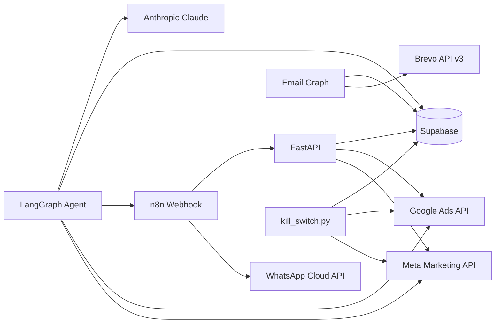

# Integrações Externas

## Visão geral



---

## Meta Ads API

**Arquivo:** `agent/tools/meta_ads.py`  
**SDK:** `facebook-business>=21.0.0`  
**Versão:** `META_API_VERSION` (default `v21.0`)

### Inicialização

```python
def _init_api(access_token: str) -> None:
    FacebookAdsApi.init(access_token=access_token, api_version=_API_VERSION)
```

### Token

- Por conta: `ad_accounts.token` no Supabase (campo `platform = 'meta'`)
- Fallback global: `META_ACCESS_TOKEN` em `.env` (não usado diretamente no grafo se token por conta existir)

### Operações implementadas

| Função | Descrição |
|--------|-----------|
| `get_ad_accounts` | Lista contas acessíveis pelo token |
| `get_campaigns` | Campanhas com status e budget |
| `get_campaign_insights` | Insights 7d com spend, ROAS, CPA, CTR |
| `update_campaign_budget` | Budget em centavos USD |
| `pause_campaign` | Status `PAUSED` |
| `activate_campaign` | Status `ACTIVE` |

### Retry

Códigos de rate-limit Meta `17`, `613`, `80004` — backoff exponencial (3 tentativas).

### Uso no agente

**Analista** (Meta live):
- `fetch_meta_campaigns_live` → `meta_ads.get_campaigns`
- `fetch_meta_insights_live` → `meta_ads.get_campaign_insights` → normalizado via `UnifiedMetrics`

**Executor:**
- `run_meta_action` → pause/activate/budget conforme `action_type`

**Aprovação humana:**
- `api/routers/decisions.py` → `_execute_action` → `meta_ads.*`

**Kill switch:**
- `scripts/kill_switch.py` → `_pause_meta`

### Campos de insights consumidos

```python
_INSIGHT_FIELDS = [
    "spend", "impressions", "clicks", "actions",
    "action_values", "cost_per_action_type", "ctr",
]
```

---

## Google Ads API

**Arquivo:** `agent/tools/google_ads.py`  
**SDK:** `google-ads>=25.0.0`

### Autenticação

OAuth via env + refresh token por conta:

```python
def _build_client(credentials: dict[str, Any]) -> GoogleAdsClient:
    config = {
        "use_proto_plus": True,
        "developer_token": settings.google_ads_developer_token,
        **credentials,  # client_id, client_secret, refresh_token, login_customer_id
    }
    return GoogleAdsClient.load_from_dict(config)
```

| Variável env | Uso |
|--------------|-----|
| `GOOGLE_ADS_DEVELOPER_TOKEN` | Token de desenvolvedor |
| `GOOGLE_ADS_CLIENT_ID` / `CLIENT_SECRET` | OAuth app |
| `GOOGLE_ADS_LOGIN_CUSTOMER_ID` | MCC (opcional) |
| `ad_accounts.token` | Refresh token por conta |

### GAQL — leitura

```sql
SELECT
    campaign.id,
    campaign.name,
    campaign.status,
    campaign_budget.id,
    campaign_budget.amount_micros
FROM campaign
WHERE campaign.status != 'REMOVED'
ORDER BY campaign.name
```

Insights com métricas de performance em queries separadas (`get_campaign_insights`).

### Mutate — escrita

| Função | Operação |
|--------|----------|
| `pause_campaign` | `CampaignService.mutate_campaigns` → status `PAUSED` |
| `activate_campaign` | status `ENABLED` |
| `update_campaign_budget` | `CampaignBudgetService.mutate_campaign_budgets` → `amount_micros` |

Budget Google usa **micros** (USD × 1_000_000). O payload da decisão deve incluir `campaign_budget_id` e `amount_micros`.

### Retry

`RESOURCE_EXHAUSTED` e `UNAVAILABLE` — backoff exponencial.

### Gap atual

Ferramentas Google existem em `agent/tools/google_ads.py` mas o nó `analista` **não as expõe** — Google usa apenas dados do Supabase (`fetch_daily_metrics`). Live fetch **[PLANEJADO]**.

---

## n8n Webhooks

**Arquivo:** `agent/graph.py` — ferramenta `notify_human`  
**Config:** `N8N_WEBHOOK_URL`, `NOTIFY_PHONE_NUMBER`

### Fluxo outbound (agente → n8n)

Quando uma decisão precisa de aprovação humana, o executor chama `notify_human`:

```python
payload = {
    "decision_id":   decision_id,
    "campaign_name": campaign_name,
    "action_type":   action_type,
    "risk_level":    risk_level,
    "reasoning":     reasoning,
    "phone_number":  settings.notify_phone_number,
}

async with httpx.AsyncClient(timeout=10) as client:
    resp = await client.post(webhook_url, json=payload)
```

Se `N8N_WEBHOOK_URL` estiver vazio → log only (`channel: "log_only"`).

### Fluxo inbound (n8n → API)

O n8n recebe a resposta do WhatsApp e chama a API Veltrus:

```bash
# Aprovar
PATCH /decisions/{decision_id}/approve
X-API-Key: {API_SECRET_KEY}
{"approved_by": "whatsapp:5511999998888"}

# Rejeitar
PATCH /decisions/{decision_id}/reject
X-API-Key: {API_SECRET_KEY}
{"rejected_by": "whatsapp:5511999998888", "reason": "Rejeitado via WhatsApp"}
```

### Workflow n8n (documentado no README)

1. Webhook trigger (recebe payload do agente)
2. HTTP → WhatsApp Business Cloud API (mensagem interativa com botões)
3. Webhook callback (resposta do usuário)
4. Switch Aprovar / Rejeitar
5. PATCH na API Veltrus
6. Confirmação WhatsApp

**Router de webhooks na API:** `api/routers/webhooks.py` existe mas está **vazio e não montado**. Callbacks vão direto para `/decisions/*`.

### Evolution API [PLANEJADO]

Não há código referenciando Evolution API. A integração WhatsApp atual usa **WhatsApp Business Cloud API** no workflow n8n. Evolution API pode substituir o passo 2 do workflow mantendo o mesmo contrato de webhook.

---

## WhatsApp

| Aspecto | Implementação atual |
|---------|---------------------|
| Envio | n8n → WhatsApp Cloud API (`graph.facebook.com`) |
| Recepção | Webhook WhatsApp → n8n |
| Número destino | `NOTIFY_PHONE_NUMBER` (E.164) no payload |
| Aprovação | Botões interativos → n8n → `PATCH /decisions` |

---

## Brevo (Email)

**Arquivo:** `agent/tools/email_brevo.py`  
**Grafo:** `agent/email_graph.py`  
**Config:** `BREVO_API_KEY`, `BREVO_API_BASE_URL` (default `https://api.brevo.com/v3`)

### Autenticação

```python
def _headers() -> dict[str, str]:
    return {
        "api-key": settings.brevo_api_key,
        "accept": "application/json",
        "content-type": "application/json",
    }
```

### Operações

| Função | Endpoint Brevo |
|--------|----------------|
| `get_account_stats` | `GET /account` |
| `get_lists` | `GET /contacts/lists` |
| `get_campaigns` | `GET /emailCampaigns` |
| `create_email_campaign` | `POST /emailCampaigns` |
| `send_campaign` | `POST /emailCampaigns/{id}/sendNow` |
| `get_campaign_report` | `GET /emailCampaigns/{id}` |
| `add_contact` | `POST /contacts` |
| `get_best_send_time` | Heurística local + histórico Brevo |

### Persistência

Tabela `email_campaigns` — `campaign_id_brevo`, métricas, HTML, briefing, copy variants.

### Trigger

`POST /run-email` com `client_id`, `list_id`, `context` opcional.

---

## Anthropic Claude

**Config:** `ANTHROPIC_API_KEY`, `ANTHROPIC_MODEL` (default `claude-sonnet-4-6`)

Usado em todos os nós LLM dos grafos de ads e email via `langchain-anthropic`.

O nó `pesquisador` do email graph usa a tool `web_search` da Anthropic.

---

## Supabase

**Arquivo:** `agent/tools/supabase_client.py`

```python
supabase = create_client(settings.supabase_url, settings.supabase_service_role_key)
```

REST API apenas — sem conexão Postgres direta. Detalhes: [supabase.md](./supabase.md).

---

## Normalizador de métricas

**Arquivo:** `agent/tools/normalizer.py`

Converte payloads Meta/Google em `UnifiedMetrics`:

- `conversions_click`, `cpa_click`, `roas_click`
- `confidence_score`, `attribution_window`
- Campos usados pelo analista e kill switch

---

## Matriz de integração por componente

| Componente | Meta | Google | n8n | Brevo | Supabase | Claude |
|------------|------|--------|-----|-------|----------|--------|
| `agent/graph.py` analista | ✅ live | ⚠️ Supabase only | — | — | ✅ | ✅ |
| `agent/graph.py` executor | ✅ | ✅ | ✅ notify | — | ✅ | ✅ |
| `api/decisions.py` approve | ✅ | ✅ | — | — | ✅ | — |
| `agent/email_graph.py` | — | — | — | ✅ | ✅ | ✅ |
| `scripts/kill_switch.py` | ✅ pause | ✅ pause | — | — | ✅ | — |

---

## Links

- [api.md](./api.md) — endpoints que disparam integrações
- [agent.md](./agent.md) — ferramentas nos nós LangGraph
- [architecture.md](./architecture.md) — diagrama n8n → WhatsApp
- [deploy.md](./deploy.md) — variáveis de ambiente
