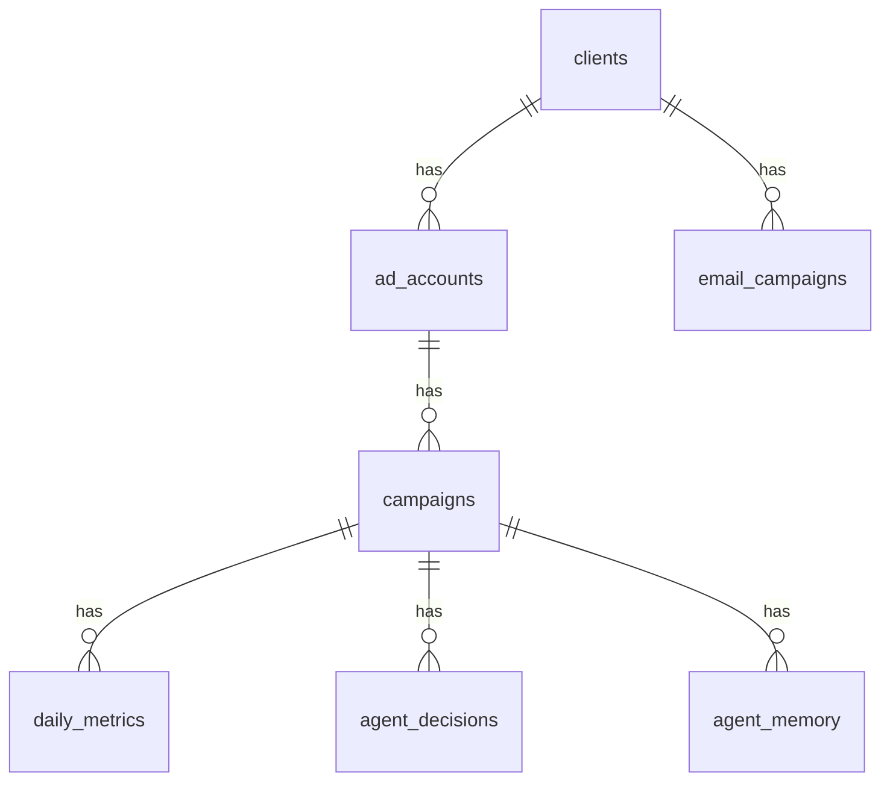

# Supabase — Schema do Banco

Todas as migrations estão em `supabase/migrations/`. O agente e a API acessam o banco via **Supabase REST** (`supabase-py`) com `SUPABASE_SERVICE_ROLE_KEY` — sem conexão direta na porta 5432.

Extensões habilitadas: `uuid-ossp`, `vector` (pgvector).

---

## Diagrama de relacionamentos



---

## `clients`

Clientes da Veltrus gerenciados pelo agente.

**Migration:** `001_initial_schema.sql`

| Coluna | Tipo | Constraints | Descrição |
|--------|------|-------------|-----------|
| `id` | `uuid` | PK, default `uuid_generate_v4()` | Identificador |
| `name` | `text` | NOT NULL | Nome do cliente |
| `vertical` | `text` | NOT NULL | Ex.: `ecommerce`, `saas` |
| `business_dna` | `jsonb` | NOT NULL, default `'{}'` | Briefing, tom de voz, objetivos, restrições |
| `active` | `boolean` | NOT NULL, default `true` | Cliente ativo |
| `created_at` | `timestamptz` | NOT NULL, default `now()` | |
| `updated_at` | `timestamptz` | NOT NULL, default `now()` | Auto via trigger |

**Trigger:** `clients_updated_at` → `set_updated_at()`

**Exemplo de `business_dna`** (de `scripts/seed_test_data.py`):

```json
{
  "descricao": "Loja de moda feminina premium com forte presença digital.",
  "tom_de_voz": "sofisticado, próximo, aspiracional",
  "produtos_destaque": ["vestidos", "acessórios", "calçados"],
  "ticket_medio_brl": 380,
  "sazonalidade": ["dia das mães", "black friday", "natal"],
  "restricoes": [
    "não pausar campanhas sem aprovação humana em feriados",
    "budget mínimo diário: $50"
  ],
  "objetivo_principal": "maximizar ROAS mantendo CPA < $25"
}
```

---

## `ad_accounts`

Contas de anúncios vinculadas a um cliente.

| Coluna | Tipo | Constraints | Descrição |
|--------|------|-------------|-----------|
| `id` | `uuid` | PK | |
| `client_id` | `uuid` | NOT NULL, FK → `clients(id)` ON DELETE CASCADE | |
| `platform` | `text` | NOT NULL, CHECK `('meta', 'google')` | Plataforma |
| `account_id` | `text` | NOT NULL | ID externo (ex.: `act_123` ou customer ID Google) |
| `token` | `text` | nullable | Access token Meta ou refresh token Google |
| `active` | `boolean` | NOT NULL, default `true` | |
| `created_at` | `timestamptz` | NOT NULL | |
| `updated_at` | `timestamptz` | NOT NULL | |

**Unique:** `(platform, account_id)`

> Tokens são lidos apenas com `service_role` — nunca expostos na API (`_format_decision` remove `token`).

---

## `campaigns`

Campanhas monitoradas por conta.

| Coluna | Tipo | Constraints | Descrição |
|--------|------|-------------|-----------|
| `id` | `uuid` | PK | UUID interno |
| `account_id` | `uuid` | FK → `ad_accounts(id)` CASCADE | |
| `campaign_id` | `text` | NOT NULL | ID externo na plataforma |
| `name` | `text` | NOT NULL | |
| `platform` | `text` | CHECK `('meta', 'google')` | |
| `status` | `text` | default `'active'`, CHECK `('active','paused','archived')` | |
| `objective` | `text` | nullable | Ex.: `CONVERSIONS` |
| `daily_budget` | `numeric(12,2)` | nullable | USD |
| `created_at` / `updated_at` | `timestamptz` | | |

**Unique:** `(account_id, campaign_id)`  
**Index:** `campaigns_account_status_idx` on `(account_id, status)`

---

## `daily_metrics`

Métricas diárias por campanha.

| Coluna | Tipo | Default | Descrição |
|--------|------|---------|-----------|
| `id` | `uuid` | PK | |
| `campaign_id` | `uuid` | FK → `campaigns(id)` CASCADE | |
| `date` | `date` | NOT NULL | |
| `spend` | `numeric(12,4)` | 0 | USD |
| `impressions` | `bigint` | 0 | |
| `clicks` | `bigint` | 0 | |
| `conversions` | `numeric(12,4)` | 0 | |
| `cpa` | `numeric(12,4)` | nullable | |
| `roas` | `numeric(12,4)` | nullable | |
| `ctr` | `numeric(8,6)` | nullable | |
| `raw_payload` | `jsonb` | nullable | Resposta bruta da API |
| `created_at` | `timestamptz` | `now()` | |
| `attribution_window` | `text` | `'unknown'` | **002** — janela de atribuição |
| `confidence_score` | `numeric(4,3)` | `0.400` | **002** — confiança dos dados |

**Unique:** `(campaign_id, date)`  
**Index:** `daily_metrics_campaign_date_idx` on `(campaign_id, date DESC)`

Normalização: `agent/tools/normalizer.py` → `UnifiedMetrics`.

---

## `agent_decisions`

> A tabela solicitada como `decisions` no repositório chama-se **`agent_decisions`**.

Histórico de decisões do agente e fila de aprovação humana.

| Coluna | Tipo | Default | Descrição |
|--------|------|---------|-----------|
| `id` | `uuid` | PK | |
| `campaign_id` | `uuid` | FK → `campaigns(id)` CASCADE | |
| `action_type` | `text` | NOT NULL | Ex.: `budget_increase`, `pause_campaign` |
| `reasoning` | `text` | NOT NULL | Raciocínio do LLM |
| `payload` | `jsonb` | `'{}'` | Parâmetros da ação + `api_result` após execução |
| `executed` | `boolean` | `false` | Se a ação foi aplicada na API |
| `approved_by` | `text` | nullable | `"autonomous"`, email, ou `"rejected:..."` |
| `approved_at` | `timestamptz` | nullable | Timestamp de aprovação/rejeição |
| `created_at` | `timestamptz` | `now()` | |

**Index:** `agent_decisions_campaign_idx` on `(campaign_id, created_at DESC)`

### Estados semânticos

| `executed` | `approved_at` | Significado |
|------------|---------------|-------------|
| `false` | `null` | Pendente |
| `true` | preenchido | Aprovada e executada |
| `false` | preenchido | Rejeitada |

### `agent_executions`

**Tabela não existe.** Rastreamento de execução usa `agent_decisions.executed` + `payload.api_result` + `execution_result` em memória no grafo.

---

## `agent_memory`

Memória semântica do agente (pgvector).

| Coluna | Tipo | Default | Descrição |
|--------|------|---------|-----------|
| `id` | `uuid` | PK | |
| `campaign_id` | `uuid` | FK nullable | `null` = memória global |
| `content` | `text` | NOT NULL | Texto da memória |
| `embedding` | `vector(1536)` | nullable | **[PLANEJADO]** preenchimento futuro |
| `memory_type` | `text` | `'observation'` | `observation`, `pattern`, `rule`, `context` |
| `created_at` | `timestamptz` | `now()` | |

**Index:** `agent_memory_embedding_idx` — HNSW on `embedding vector_cosine_ops` (m=16, ef_construction=64)

Busca atual: `search_agent_memory` usa `ilike` textual, não similarity search.

---

## `kill_switch_log`

Auditoria do script `scripts/kill_switch.py` (migration `003`).

| Coluna | Tipo | Descrição |
|--------|------|-----------|
| `id` | `uuid` | PK |
| `account_external_id` | `text` | ID externo da conta |
| `campaign_external_id` | `text` | ID externo da campanha |
| `campaign_name` | `text` | |
| `platform` | `text` | `meta` \| `google` |
| `client_name` | `text` | nullable |
| `trigger_type` | `text` | `spend_overage`, `cpa_spike`, `roas_critical` |
| `action_taken` | `text` | `paused`, `alerted`, `pause_failed`, `dry_run` |
| `trigger_value` | `numeric(12,4)` | Valor que disparou |
| `threshold_value` | `numeric(12,4)` | Limite excedido |
| `resolved` | `boolean` | default `false` |
| `notes` | `text` | nullable |
| `created_at` | `timestamptz` | |

**Indexes:** `kill_switch_log_created_idx`, `kill_switch_log_resolved_idx`

---

## `email_campaigns`

Campanhas Brevo gerenciadas pelo agente de email (migration `004`).

| Coluna | Tipo | Descrição |
|--------|------|-----------|
| `id` | `uuid` | PK |
| `client_id` | `uuid` | FK → `clients(id)` |
| `campaign_id_brevo` | `bigint` | UNIQUE — ID na API Brevo |
| `subject` | `text` | |
| `name` | `text` | nullable |
| `list_id` | `bigint` | nullable |
| `sent`, `delivered`, `unique_opens`, `unique_clicks` | `integer` | Métricas |
| `open_rate`, `click_rate`, `bounce_rate`, `unsubscribe_rate` | `numeric(8,6)` | |
| `html_content` | `text` | |
| `copy_variants` | `jsonb` | default `[]` |
| `briefing` | `jsonb` | default `{}` |
| `analysis` | `jsonb` | default `{}` |
| `scheduled_at`, `sent_at`, `report_fetched_at` | `timestamptz` | |
| `raw_report` | `jsonb` | |
| `created_at` / `updated_at` | `timestamptz` | |

**Indexes:** `email_campaigns_client_idx`, `email_campaigns_sent_at_idx`, `email_campaigns_pending_report_idx` (partial, `report_fetched_at IS NULL`)

---

## Row Level Security (RLS)

RLS está **habilitado** em todas as tabelas. **Nenhuma policy** foi definida nas migrations — comportamento deny-by-default para `anon` e `authenticated`.

| Tabela | RLS | Policies | Grants extras |
|--------|-----|----------|---------------|
| `clients` | ✅ | nenhuma | — |
| `ad_accounts` | ✅ | nenhuma | — |
| `campaigns` | ✅ | nenhuma | — |
| `daily_metrics` | ✅ | nenhuma | — |
| `agent_decisions` | ✅ | nenhuma | — |
| `agent_memory` | ✅ | nenhuma | — |
| `kill_switch_log` | ✅ | nenhuma | ALL → service_role, authenticated, anon |
| `email_campaigns` | ✅ | nenhuma | ALL → service_role, authenticated, anon |

**Acesso em produção:** agente e API usam `SUPABASE_SERVICE_ROLE_KEY`, que **bypassa RLS**.

Policies de leitura para o dashboard Next.js estão **[PLANEJADO]** (comentário em `001_initial_schema.sql`).

---

## Índices — resumo

| Índice | Tabela | Colunas |
|--------|--------|---------|
| `agent_memory_embedding_idx` | `agent_memory` | HNSW(`embedding`) |
| `daily_metrics_campaign_date_idx` | `daily_metrics` | `(campaign_id, date DESC)` |
| `agent_decisions_campaign_idx` | `agent_decisions` | `(campaign_id, created_at DESC)` |
| `campaigns_account_status_idx` | `campaigns` | `(account_id, status)` |
| `kill_switch_log_created_idx` | `kill_switch_log` | `(created_at DESC)` |
| `kill_switch_log_resolved_idx` | `kill_switch_log` | `(resolved, created_at DESC)` |
| `email_campaigns_client_idx` | `email_campaigns` | `(client_id, created_at DESC)` |
| `email_campaigns_sent_at_idx` | `email_campaigns` | `(sent_at DESC)` |
| `email_campaigns_pending_report_idx` | `email_campaigns` | `(sent_at)` WHERE `report_fetched_at IS NULL` |

---

## Migrations

| Arquivo | Conteúdo |
|---------|----------|
| `001_initial_schema.sql` | Tabelas core + RLS + triggers |
| `002_add_normalized_fields.sql` | `attribution_window`, `confidence_score` em `daily_metrics` |
| `003_kill_switch_log.sql` | Tabela de auditoria do kill switch |
| `004_email_campaigns.sql` | Campanhas Brevo |

`supabase/seed.sql` está vazio — dados de teste via `scripts/seed_test_data.py`.

---

## Cliente Supabase no código

```python
# agent/tools/supabase_client.py
from supabase import create_client
supabase = create_client(settings.supabase_url, settings.supabase_service_role_key)
```

---

## Links

- [agent.md](./agent.md) — como o agente lê/escreve nas tabelas
- [guardrails.md](./guardrails.md) — `kill_switch_log` e `business_dna`
- [api.md](./api.md) — endpoints que consultam `agent_decisions`
