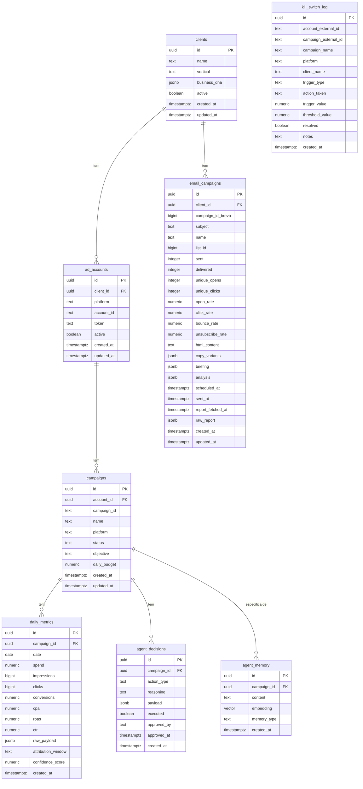

# Supabase — Schema do Banco de Dados

O banco usa **Supabase** (Postgres gerenciado) com as extensões `uuid-ossp` e `vector` (pgvector). Todo o acesso é feito via REST API (supabase-py), nunca por conexão direta na porta 5432.

**Migrations aplicadas:**

| Arquivo | Conteúdo |
|---------|---------|
| `001_initial_schema.sql` | Tabelas principais: clients, ad_accounts, campaigns, daily_metrics, agent_decisions, agent_memory |
| `002_add_normalized_fields.sql` | Adiciona `attribution_window` e `confidence_score` em `daily_metrics` |
| `003_kill_switch_log.sql` | Tabela de auditoria do kill switch |
| `004_email_campaigns.sql` | Tabela de campanhas de email marketing (Brevo) |

---

## Visão do Schema



---

## Tabelas Detalhadas

### `public.clients`

Clientes da Veltrus que têm campanhas gerenciadas pelo agente.

| Coluna | Tipo | Nulo | Padrão | Descrição |
|--------|------|------|--------|-----------|
| `id` | `uuid` | NOT NULL | `uuid_generate_v4()` | PK |
| `name` | `text` | NOT NULL | — | Nome do cliente |
| `vertical` | `text` | NOT NULL | — | Segmento: `"ecommerce"`, `"saas"`, `"retail"`, etc. |
| `business_dna` | `jsonb` | NOT NULL | `'{}'` | JSON livre: identidade de marca, restrições, objetivos, tom de voz |
| `active` | `boolean` | NOT NULL | `true` | Conta ativa para processamento |
| `created_at` | `timestamptz` | NOT NULL | `now()` | — |
| `updated_at` | `timestamptz` | NOT NULL | `now()` | Atualizado via trigger `set_updated_at()` |

**`business_dna` — Campos usados pelo agente:**
```json
{
  "objetivo_principal": "maximizar ROAS mantendo CPA < $25",
  "tom_de_voz": "consultivo e direto",
  "restricoes": ["sem menção a concorrentes", "preço mínimo R$50"],
  "vertical_especifico": "ecommerce de moda",
  "run_context": "contexto adicional passado via POST /run-email",
  "preferred_list_id": 123
}
```

O campo `objetivo_principal` é parseado pelo kill switch para extrair `cpa_max` via regex.

---

### `public.ad_accounts`

Contas de ads vinculadas a um cliente.

| Coluna | Tipo | Nulo | Padrão | Descrição |
|--------|------|------|--------|-----------|
| `id` | `uuid` | NOT NULL | `uuid_generate_v4()` | PK |
| `client_id` | `uuid` | NOT NULL | — | FK → `clients.id` (cascade delete) |
| `platform` | `text` | NOT NULL | — | `'meta'` ou `'google'` (CHECK constraint) |
| `account_id` | `text` | NOT NULL | — | ID externo da plataforma (ex: `act_123456789`) |
| `token` | `text` | NULL | — | Access token renovável — **NUNCA expor via anon key** |
| `active` | `boolean` | NOT NULL | `true` | Conta ativa para processamento |
| `created_at` | `timestamptz` | NOT NULL | `now()` | — |
| `updated_at` | `timestamptz` | NOT NULL | `now()` | — |

**Constraint única:** `(platform, account_id)` — impede duplicação de conta.

**Nota de segurança:** O campo `token` contém o access token OAuth da conta. Deve ser lido apenas com `service_role_key`. O campo é removido dos responses da API em `_format_decision()`.

---

### `public.campaigns`

Campanhas monitoradas pelo agente.

| Coluna | Tipo | Nulo | Padrão | Descrição |
|--------|------|------|--------|-----------|
| `id` | `uuid` | NOT NULL | `uuid_generate_v4()` | PK (UUID interno) |
| `account_id` | `uuid` | NOT NULL | — | FK → `ad_accounts.id` (cascade delete) |
| `campaign_id` | `text` | NOT NULL | — | ID externo na plataforma (ex: `120200123456`) |
| `name` | `text` | NOT NULL | — | Nome da campanha |
| `platform` | `text` | NOT NULL | — | `'meta'` ou `'google'` (CHECK constraint) |
| `status` | `text` | NOT NULL | `'active'` | `'active'`, `'paused'` ou `'archived'` (CHECK constraint) |
| `objective` | `text` | NULL | — | ex: `"CONVERSIONS"`, `"REACH"`, `"TRAFFIC"` |
| `daily_budget` | `numeric(12,2)` | NULL | — | Budget diário em USD |
| `created_at` | `timestamptz` | NOT NULL | `now()` | — |
| `updated_at` | `timestamptz` | NOT NULL | `now()` | — |

**Constraint única:** `(account_id, campaign_id)`.

---

### `public.daily_metrics`

Métricas diárias por campanha (uma linha por campanha/dia).

| Coluna | Tipo | Nulo | Padrão | Descrição |
|--------|------|------|--------|-----------|
| `id` | `uuid` | NOT NULL | `uuid_generate_v4()` | PK |
| `campaign_id` | `uuid` | NOT NULL | — | FK → `campaigns.id` (cascade delete) |
| `date` | `date` | NOT NULL | — | Data da métrica |
| `spend` | `numeric(12,4)` | NOT NULL | `0` | Gasto em USD |
| `impressions` | `bigint` | NOT NULL | `0` | Impressões |
| `clicks` | `bigint` | NOT NULL | `0` | Cliques |
| `conversions` | `numeric(12,4)` | NOT NULL | `0` | Conversões totais |
| `cpa` | `numeric(12,4)` | NULL | — | Custo por aquisição (spend / conversions) |
| `roas` | `numeric(12,4)` | NULL | — | Retorno sobre gasto (revenue / spend) |
| `ctr` | `numeric(8,6)` | NULL | — | Taxa de clique (clicks / impressions) |
| `raw_payload` | `jsonb` | NULL | — | Resposta bruta da API para auditoria/reprocessamento |
| `attribution_window` | `text` | NOT NULL | `'unknown'` | Janela de atribuição (adicionado em 002) |
| `confidence_score` | `numeric(4,3)` | NOT NULL | `0.400` | Qualidade dos dados 0.0–1.0 (adicionado em 002) |
| `created_at` | `timestamptz` | NOT NULL | `now()` | — |

**Constraint única:** `(campaign_id, date)`.

**Índice:** `daily_metrics_campaign_date_idx ON (campaign_id, date DESC)`.

**Valores de `attribution_window`:**
- `"7d_click_1d_view"` — Meta padrão
- `"30d_click_1d_view"` — Google padrão
- `"unknown"` — seed/legacy

**Tiers de `confidence_score`:** ver [agent.md](./agent.md#unified-marketing-schema-normalizer).

---

### `public.agent_decisions`

Histórico de todas as decisões tomadas pelo agente.

| Coluna | Tipo | Nulo | Padrão | Descrição |
|--------|------|------|--------|-----------|
| `id` | `uuid` | NOT NULL | `uuid_generate_v4()` | PK |
| `campaign_id` | `uuid` | NOT NULL | — | FK → `campaigns.id` (cascade delete) |
| `action_type` | `text` | NOT NULL | — | `"budget_increase"`, `"budget_decrease"`, `"pause_campaign"`, `"activate_campaign"`, `"monitor_only"` |
| `reasoning` | `text` | NOT NULL | — | Chain-of-thought completo do LLM |
| `payload` | `jsonb` | NOT NULL | `'{}'` | Parâmetros da ação + resultado da API (após execução) |
| `executed` | `boolean` | NOT NULL | `false` | `true` = ação executada |
| `approved_by` | `text` | NULL | — | Email ou `"autonomous"` ou `"rejected:{email}"` |
| `approved_at` | `timestamptz` | NULL | — | Timestamp de aprovação/rejeição |
| `created_at` | `timestamptz` | NOT NULL | `now()` | — |

**Índice:** `agent_decisions_campaign_idx ON (campaign_id, created_at DESC)`.

**Estados:**
```
executed=false, approved_at=null     → ⏳ Pendente
executed=true,  approved_at=<ts>     → ✅ Executada
executed=false, approved_at=<ts>     → ❌ Rejeitada
```

---

### `public.agent_memory`

Memória semântica persistente do agente (busca por texto ou similaridade vetorial).

| Coluna | Tipo | Nulo | Padrão | Descrição |
|--------|------|------|--------|-----------|
| `id` | `uuid` | NOT NULL | `uuid_generate_v4()` | PK |
| `campaign_id` | `uuid` | NULL | — | FK → `campaigns.id`; `NULL` = memória global |
| `content` | `text` | NOT NULL | — | Texto da memória (observação, padrão, insight) |
| `embedding` | `vector(1536)` | NULL | — | Embedding para similarity search (null por enquanto) |
| `memory_type` | `text` | NOT NULL | `'observation'` | `'observation'`, `'pattern'`, `'rule'`, `'context'` (CHECK constraint) |
| `created_at` | `timestamptz` | NOT NULL | `now()` | — |

**Índice HNSW:** `agent_memory_embedding_idx USING hnsw (embedding vector_cosine_ops)` com `m=16, ef_construction=64`.

**Busca atual:** A busca de memória usa `ilike` (correspondência textual) enquanto o serviço de embeddings não está integrado. O índice HNSW está preparado para similarity search com `vector_cosine_ops` quando os embeddings forem preenchidos.

---

### `public.email_campaigns`

Campanhas de email criadas e disparadas pelo Agente de Email (via Brevo).

| Coluna | Tipo | Nulo | Padrão | Descrição |
|--------|------|------|--------|-----------|
| `id` | `uuid` | NOT NULL | `uuid_generate_v4()` | PK |
| `client_id` | `uuid` | NOT NULL | — | FK → `clients.id` (cascade delete) |
| `campaign_id_brevo` | `bigint` | NOT NULL | — | ID retornado por `POST /emailCampaigns` na Brevo |
| `subject` | `text` | NOT NULL | — | Subject line selecionado |
| `name` | `text` | NULL | — | Nome interno da campanha |
| `list_id` | `bigint` | NULL | — | ID da lista de contatos no Brevo |
| `sent` | `integer` | NULL | — | Total de emails enviados |
| `delivered` | `integer` | NULL | — | Total entregues |
| `unique_opens` | `integer` | NULL | — | Aberturas únicas |
| `unique_clicks` | `integer` | NULL | — | Cliques únicos |
| `open_rate` | `numeric(8,6)` | NULL | — | Taxa de abertura |
| `click_rate` | `numeric(8,6)` | NULL | — | Taxa de clique |
| `bounce_rate` | `numeric(8,6)` | NULL | — | Taxa de bounce |
| `unsubscribe_rate` | `numeric(8,6)` | NULL | — | Taxa de descadastro |
| `html_content` | `text` | NULL | — | HTML completo gerado pelo COPYWRITER |
| `copy_variants` | `jsonb` | NOT NULL | `'[]'` | 3 variações de subject geradas |
| `briefing` | `jsonb` | NOT NULL | `'{}'` | Pesquisa de mercado do PESQUISADOR |
| `analysis` | `jsonb` | NOT NULL | `'{}'` | Análise de lista + timing do ANALISTA |
| `scheduled_at` | `timestamptz` | NULL | — | Data/hora de envio agendado |
| `sent_at` | `timestamptz` | NULL | — | Data/hora real de envio |
| `report_fetched_at` | `timestamptz` | NULL | — | Quando o ANALISTA_DE_RESULTADOS buscou métricas |
| `raw_report` | `jsonb` | NULL | — | Resposta bruta da API Brevo (auditoria) |
| `created_at` | `timestamptz` | NOT NULL | `now()` | — |
| `updated_at` | `timestamptz` | NOT NULL | `now()` | — |

**Constraint única:** `campaign_id_brevo`.

**Índices:**
- `email_campaigns_client_idx ON (client_id, created_at DESC)`
- `email_campaigns_sent_at_idx ON (sent_at DESC)`
- `email_campaigns_pending_report_idx ON (sent_at) WHERE report_fetched_at IS NULL` — campanhas sem relatório

---

### `public.kill_switch_log`

Auditoria de todas as ações do kill switch de proteção financeira.

| Coluna | Tipo | Nulo | Padrão | Descrição |
|--------|------|------|--------|-----------|
| `id` | `uuid` | NOT NULL | `uuid_generate_v4()` | PK |
| `account_external_id` | `text` | NOT NULL | — | ID externo da plataforma (ex: `act_xxx`) |
| `campaign_external_id` | `text` | NOT NULL | — | ID externo da campanha |
| `campaign_name` | `text` | NOT NULL | — | Nome da campanha |
| `platform` | `text` | NOT NULL | — | `'meta'` ou `'google'` (CHECK constraint) |
| `client_name` | `text` | NULL | — | Nome do cliente (informativo) |
| `trigger_type` | `text` | NOT NULL | — | `'spend_overage'`, `'cpa_spike'`, `'roas_critical'` (CHECK constraint) |
| `action_taken` | `text` | NOT NULL | — | `'paused'`, `'alerted'`, `'pause_failed'`, `'dry_run'` (CHECK constraint) |
| `trigger_value` | `numeric(12,4)` | NOT NULL | — | Valor que disparou a regra |
| `threshold_value` | `numeric(12,4)` | NOT NULL | — | Limite que foi excedido |
| `resolved` | `boolean` | NOT NULL | `false` | Marcado `true` após revisão humana |
| `notes` | `text` | NULL | — | Campo livre para o operador anotar |
| `created_at` | `timestamptz` | NOT NULL | `now()` | — |

**Índices:**
- `kill_switch_log_created_idx ON (created_at DESC)`
- `kill_switch_log_resolved_idx ON (resolved, created_at DESC)`

---

## Row Level Security (RLS)

RLS está **habilitado** em todas as tabelas. A estratégia atual é **deny-by-default** para o anon key.

| Tabela | RLS | Política atual |
|--------|-----|----------------|
| `clients` | ✅ habilitado | Nenhuma política anon definida — acesso apenas via `service_role` |
| `ad_accounts` | ✅ habilitado | Nenhuma política anon definida |
| `campaigns` | ✅ habilitado | Nenhuma política anon definida |
| `daily_metrics` | ✅ habilitado | Nenhuma política anon definida |
| `agent_decisions` | ✅ habilitado | Nenhuma política anon definida |
| `agent_memory` | ✅ habilitado | Nenhuma política anon definida |
| `email_campaigns` | ✅ habilitado | `GRANT ALL TO service_role, authenticated, anon` |
| `kill_switch_log` | ✅ habilitado | `GRANT ALL TO service_role, authenticated, anon` |

**O agente usa `SUPABASE_SERVICE_ROLE_KEY`**, que bypassa RLS e tem acesso total. O dashboard Next.js usa `SUPABASE_ANON_KEY` para leitura (quando políticas de auth forem adicionadas).

---

## Acessar o Supabase

```python
# agent/tools/supabase_client.py
from supabase import create_client
from agent.config import settings

supabase = create_client(
    settings.supabase_url,
    settings.supabase_service_role_key,
)
```

Exemplos de queries:

```python
# Buscar contas ativas com cliente
result = supabase.table("ad_accounts").select("*, clients(*)").eq("active", True).execute()

# Inserir decisão
supabase.table("agent_decisions").insert({
    "campaign_id": campaign_uuid,
    "action_type": "budget_increase",
    "reasoning": "...",
    "payload": {"new_budget_usd": 172.5},
    "executed": False,
}).execute()

# Buscar decisões pendentes
supabase.table("agent_decisions")
    .select("*, campaigns(id, name, campaign_id, platform, ad_accounts(id, account_id))")
    .eq("executed", False)
    .is_("approved_at", "null")
    .order("created_at", desc=True)
    .execute()
```
